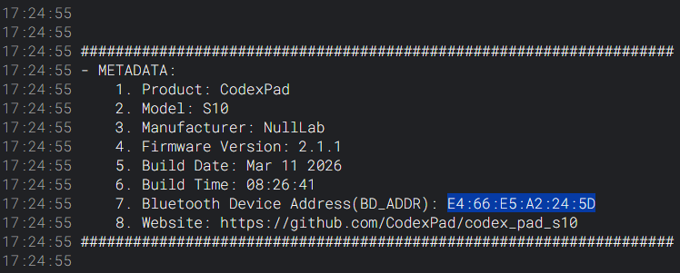
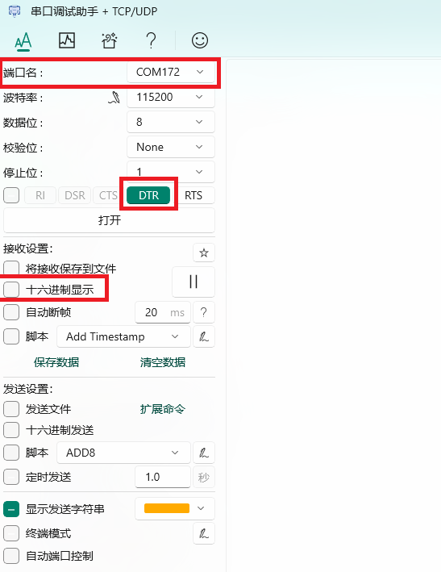
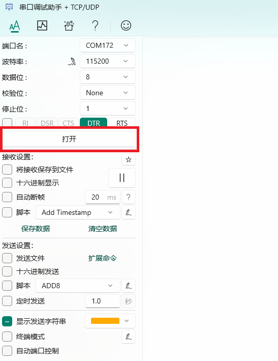
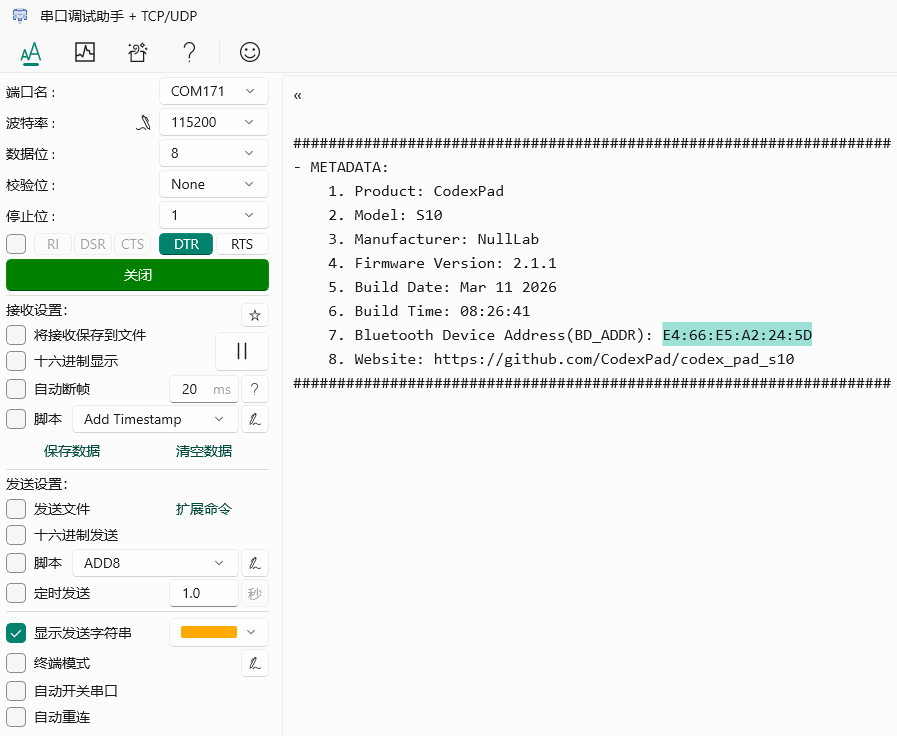
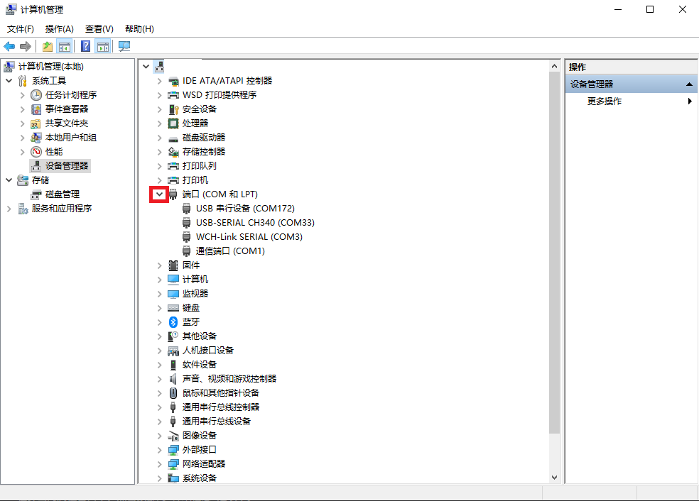
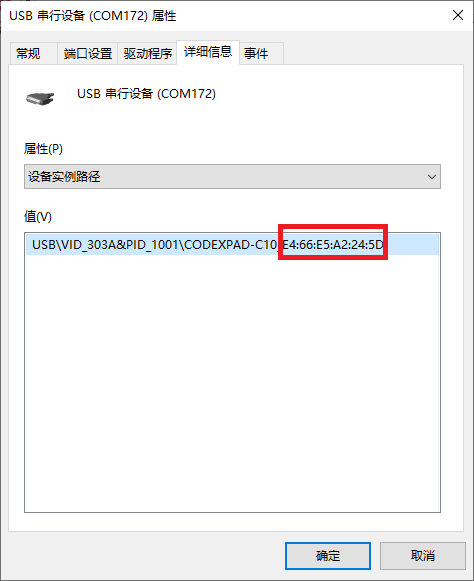

# CodexPad-C10

[English](README.md)

## 概述

**CodexPad-C10​** 是 CodexPad 系列中专为创客与嵌入式开发者设计的低功耗蓝牙手柄。与市面上依赖操作系统蓝牙协议栈的通用手柄不同，本产品**专为无操作系统的硬件平台打造**，无需系统层支持，即可直接与裸机运行的低功耗蓝牙硬件平台（如 **ESP32** 系列、**ESP32-S** 系列、**ESP32-C** 系列、**STM32** 系列、**nRF** 系列、 **micro:bit**、**树莓派**系列等）进行对等通信，为机器人、物联网设备、自定义控制面板等提供了即插即用的远程物理输入解决方案。

我们为适配的硬件平台提供了简洁的通信协议、轻量级驱动库与丰富示例，让开发者能快速将手柄集成到固件中，专注于核心功能的实现。

---

## 产品外观图

> TODO

---

## 产品部件示意图

> TODO

## 输入设备规格

- 按键数量：5
- 摇杆数量：1
- 摇杆类型：双轴模拟摇杆
- 摇杆分辨率：8位（0 ~ 255）

---

## 电气特性

- 工作电压：​3.3V (纽扣电池)
- 充电功能：无
- 续航时间：典型使用下约2小时
- 电池类型：CR2032

---

## 连接性与协议

- 蓝牙版本：Bluetooth Low Energy 5.3
- 传输距离：50m (开阔环境)
- 发射功率：**-16 dBm** 到 **+6 dBm** （可调）
- 通信协议：开放的、专为嵌入式优化的轻量级二进制协议
- 支持角色：BLE外设设备（从机）

---

## 软件与兼容性

| 硬件平台 | 支持的开发环境 |
| :--- | :--- |
| ESP32 | Arduino IDE, MicroPython，米思齐（mixly），Mind+ |
| ESP32-S3 | Arduino IDE, MicroPython，米思齐（mixly），Mind+ |
| ESP32-C3 | Arduino IDE, MicroPython，米思齐（mixly），Mind+ |
| micro:bit | MakeCode |

为上述平台提供完整的驱动库、文档及项目示例。

---

## 安装电池

- 将手柄电源开关拨动至`OFF​`端关闭电源，切断电路，防止安装过程中发生短路或静电损坏器件

- 小心剥离手柄背部外壳，露出背部电路板和电池扣插件

- 将手柄翻转至**背部朝上**

- 将CR2032纽扣电池**正极（"+"标识面）朝上**，平行于电池扣中间间隙，平滑推入，确保牢固卡住、不会脱落

---

## 安装外壳

- 电池安装完毕后，立即将外壳装回并固定好，这样**避免手直接触碰背部电路，防止因静电或短路导致器件损坏**

---

## 开机与关机

- **开机**：将手柄电源开关拨动至`ON`端打开电源，指示灯开始慢闪，设备启动。

- **关机**：将手柄电源开关拨动至`OFF`端关闭电源，指示灯熄灭，设备关机。

---

## 指示灯状态说明

| 指示灯状态 | 设备状态含义 |
| :--- | :--- |
| 慢闪 （约1秒亮/灭） | 已开机，正在广播信号，可被连接 |
| 快闪 （约100毫秒亮/灭） | 低电量警告。电池电量已不足，无法正常工作，请更换电池 |
| 常亮 | 已开机，已成功连接到主机设备 |
| 熄灭 | 已关机 |

---

## Bluetooth Device Address(BD_ADDR)说明

在连接与开发时，可能需要使用到设备的唯一标识：Bluetooth Device Address(BD_ADDR)。它如同设备的“身份证号”，若需指定连接本设备而非广播中的其他设备，将会使用到此信息

> **注意：术语说明**  
> 本文档统一使用标准术语 Bluetooth Device Address(BD_ADDR)。请注意，在部分旧的示例代码、SDK或针对旧型号设备的文档中，可能会使用 MAC Address​ 来指代 Bluetooth Device Address(BD_ADDR)。在蓝牙上下文中，两者通常指向同一个地址。

它由12位十六进制字符组成，以冒号分隔，格式为`XX:XX:XX:XX:XX:XX`（其中`X`为 0-9 或 A-F），例如：`E4:66:E5:A2:24:5D`。

### 获取Bluetooth Device Address(BD_ADDR)

> 💡 **重要提示：每台手柄均需单独获取**
>
> 由于此类手柄的Bluetooth Device Address(BD_ADDR)都是全球唯一的，因此每台新手柄在使用前，都需要按照此章节的步骤重新获取并记录其专属的Bluetooth Device Address。请勿误以为获取一次即可通用于所有手柄。

请确保手柄已**开机**，并使用USB-Type C数据线将其与电脑连接，然后使用以下方式获取Bluetooth Device Address并妥善保存。

#### 工作原理

当您使用USB数据线将手柄连接到电脑时，手柄会**虚拟成一个标准的串口设备（COM端口）**。获取Bluetooth Device Address的本质，就是通过任意串口工具与这个虚拟串口进行通信。

**通信参数与流程：**

- **通用性**：任何串口工具（网页版、Windows、macOS、Linux）在正确配置后均可使用
- **关键配置**：波特率可任意设置，但务必使能DTR信号
- **自动应答**：连接成功后，手柄自动上报包含Bluetooth Device Address(BD_ADDR)的元数据信息

理解此原理后，您可以根据自身喜好和操作系统，选择下方任意一种工具进行操作。

---

#### 获取方式1：使用网页串口工具获取

1. 确保手柄已**开机**并已通过USB连接到电脑

2. 打开浏览器访问：<https://terminal.spacehuhn.com/>

3. 点击屏幕中间的**CONNECT**图标

4. 在弹出的设备列表中，选择以`CodexPad-C10`开头的设备，然后点击**连接**

    

5. 连接成功后，内容框会打印设备信息。在其中找到标识为 `7. Mac Address:`或者`7. Bluetooth Device Address(BD_ADDR):`的一行，将其后的内容复制并妥善保存，例如：`E4:66:E5:A2:24:5D`

    

6. 断开手柄与电脑的连接

---

#### 获取方式2：通过Windows电脑的串口调试助手获取

此方法使用通用的串口调试工具与手柄通信，获取Bluetooth Device Address信息。

1. 安装串口调试助手

    - 访问串口调试助手下载页面：<https://apps.microsoft.com/detail/9nblggh43hdm?launch=true&hl=zh-cn&gl=cn>

    - 自行下载安装适用于Windows的最新版本

2. 启动串口调试助手

    - 安装完成后在桌面或开始菜单找到并启动程序

3. 配置串口连接

    - 选择正确的COM端口

        - 确保手柄已**开机**并已通过USB连接到电脑

        - 在软件界面的“**端口名**”下拉菜单中，选择对应的COM端口（例如`COM172`）

        - **如何确认哪个是手柄**：如果无法确定哪个端口对应手柄，您可以**拔掉手柄的USB线**，观察列表中哪个端口消失，**重新插上手柄**，观察哪个新出现的端口，该端口即对应您的手柄

    - 配置串口参数

        - **波特率**：可设置为任意值（如9600、115200等）

        - **数据位**：8

        - **停止位**：1

        - **校验位**：None (无)

        - **接收显示**：确保“十六进制显示”选项未勾选，以便查看文本格式的元数据

    - 启用DTR信号

        - 在软件界面中找到“**DTR**”选项，并点击启用它，选项会变为绿色

    

4. 连接并获取Bluetooth Device Address

    - 完成上述配置后，点击“**打开**”按钮建立连接

        

    - 连接成功后，手柄会自动发送一次设备元数据，并显示在软件右侧的“**接收区**”

    - 在接收区查看显示的数据找到标识为 `7. Mac Address:`或者`7. Bluetooth Device Address(BD_ADDR):`的一行，将其后的内容复制并妥善保存，例如：`E4:66:E5:A2:24:5D`

        

5. 断开手柄与电脑的连接

---

#### 获取方式3：通过Windows电脑的设备管理器获取

1. 启动“**设备管理器**”

    - **启动方式1**：启动 “**开始**”菜单，输入 “**设备管理器**”。 然后，从搜索结果中选择“**设备管理器**”点击启动

        

    - **启动方式2**：通过“**文件资源管理器**”启动

        - 在文件资源管理器中，右键单击“**此电脑**”，选择“**管理**”

            

        - 然后从生成的对话框中列出的系统工具中选择 “**设备管理器**”

            

2. 展开端口列表

   - 在设备管理器的设备列表中，找到并点击“**端口（COM和LPT）**”类别左侧的 “**>**” 符号，将其展开

        

3. 识别您的手柄设备

    - 在展开的列表中，您会看到一个或多个名为“**USB 串行设备 (COMxx)**”的条目，其中xx代表数字

    - **如何确认哪个是手柄**：如果列表中有多个此类设备，您可以**拔掉手柄的USB线**，观察列表中哪个“USB 串行设备”条目消失；**重新插上手柄**，观察哪个新出现的条目，该条目即对应您的手柄。请记下其COM口号（例如：COM172）

4. 打开设备属性

    - 右键点击您所识别出的“**USB 串行设备 (COMxx)**”，在弹出的菜单中选择“**属性**”

        

5. 查看设备详细信息

    - 在弹出的属性窗口中，点击顶部的“**详细信息**”选项卡

    - 在“**属性(P)**”下方的下拉菜单中，选择“**设备实例路径**”

        

6. 记录Bluetooth Device Address

    - 此时，“**值(V)**”下方的文本框中将显示一串信息

    - 在这串信息中，找到“**CODEXPAD-C10_**”字段，其后面紧跟的由冒号分隔的12位字符（例如：`E4:66:E5:A2:24:5D`）即为您手柄的Bluetooth Device Address

        

    - 请准确抄录这串Bluetooth Device Address并妥善保管，用于后续连接

7. 断开手柄与电脑的连接

---

## 连接方式说明

CodexPad提供了两种灵活的主机连接方式，您可以根据开发场景和需求进行选择。

### 方式一：Bluetooth Device Address 直连

此方式通过手柄唯一的 **Bluetooth Device Address** 进行精准连接。

- **工作原理**：在您的主机代码中，预先写入目标手柄的Bluetooth Device Address。程序启动后将直接尝试与这个特定地址的设备建立连接。

- **核心特点**：**指向明确，连接稳定**。适用于开发环境固定、手柄与主机配对关系确定的场景（例如，某台机器人固定使用某个特定手柄控制）。

- **使用前准备**：您需要按照 **[获取Bluetooth Device Address](#获取bluetooth-device-addressbd_addr)** 章节的步骤，获取并记录手柄的Bluetooth Device Address。

### 方式二：按键掩码扫描连接

此方式是 **CodexPad 产品的特色功能**，它通过让手柄在广播时上报按键状态，实现基于物理交互的智能匹配连接。

- **工作原理**：在您的主机代码中，定义一个“按钮掩码”（例如：同时按住 **Start键 + A键**）。主机在扫描附近设备时，只会与那些**按键状态恰好与掩码匹配**（即按住了指定按键组合且未按其他键）的、信号最强（RSSI最大）的手柄建立连接。

- **核心特点**：

    1. **防止干扰**：在多个手柄的环境中，能有效避免意外连接到其他设备。

    2. **灵活切换**：代码不绑定具体手柄Bluetooth Device Address，您可以随时拿起任何一台处于可发现状态、并正确触发按键条件的手柄进行连接，实现设备的无缝切换。

- **适用场景**：适用于多设备环境、演示场景、需要灵活更换手柄或不想在代码中硬编码硬件地址的项目。

> **提示**：关于“按键掩码扫描连接”更详细的设计意图、优势及使用示例，请参阅对应开发平台的库的文档和示例代码。

## 连接与使用

### Arduino IDE库和示例代码

适用于在 **Arduino IDE** 或 **PlatformIO** 中进行开发。

| 硬件平台 |
| :--- |
| ESP32 |
| ESP32-S3 |
| ESP32-C3 |

**详情链接**：<https://github.com/CodexPad/codex_pad_arduino_lib>

---

### MicroPython库和示例代码

适用于在 **MicroPython** 固件上进行开发。

| 硬件平台 |
| :--- |
| ESP32 |
| ESP32-S3 |
| ESP32-C3 |

详情链接：<https://github.com/CodexPad/codex_pad_mpy_lib>

---

### Micro:bit图形化扩展

适用于在 **MakeCode** 图形化编程环境中为 micro:bit 开发。

| 硬件平台 |
| :--- |
| micro:bit |

详情链接：<https://github.com/CodexPad/codex_pad_makecode_extension>

---

### 图形化

> TODO

## 🔋 电源管理

为确保产品续航并避免不必要的电量损耗，当您长时间不使用手柄时，**请务必将手柄的电源开关拨动至 OFF位置**切断电源。在电源开启 (ON) 状态下，即使没有进行任何按键操作，手柄为保持可被连接状态，其低功耗蓝牙 (BLE) 模块仍会以一定间隔进行广播，这个过程会产生持续电流消耗。主动关机是最大限度延长纽扣电池使用寿命的最有效方式。

---

## ⚡ USB Type-C 接口说明

本手柄的 USB Type-C 接口主要用于 ① 为手柄电路供电​ 和 ② 虚拟串口通信（如用于获取Bluetooth Device Address）。需要特别注意的是，此接口不具备电池充电功能。当手柄通过 USB 线缆供电运行时，若突然拔下线缆，系统会瞬间切换至纽扣电池供电。如果纽扣电池电量已处于较低水平，其电压在负载突然加大的瞬间可能无法及时响应，导致电压骤降而引发系统复位重启。此现象属于电源切换过程中的正常特性，并非设备故障。建议在需稳定使用的场景下，确保使用电量充足的电池或保持 USB 供电连接。

---

## 🛡️ 安装与静电防护

为防止静电放电 (ESD) 对精密电子元件造成不可逆的损伤，**在使用手柄前，必须确保其外部外壳已完全安装并紧固**。手柄背部的电路板直接暴露在外时，人体或环境产生的静电可能通过直接接触或近距离感应，瞬间击穿脆弱的集成电路，这种损伤通常是永久性的。完整的外壳构成了重要的物理屏障，能有效避免手部直接接触电路，是保证产品可靠性和使用寿命的关键步骤。

---

## 手柄TX Power（发射功率）设置

### 发射功率概述

发射功率（TX Power）是指手柄蓝牙射频信号的输出强度，其单位为 **dBm（分贝毫瓦）**。这是一个用于表示功率绝对值的对数单位。

- **数值大小的意义**：在dBm的标度下，**数值越大，代表发射功率越强**。例如，`+3 dBm` 的功率就比 `0 dBm` 强，而 `0 dBm` 又比 `-5 dBm` 强。每增加大约 `3 dBm`，实际功率约翻一倍。
- **正负号的意义**：`0 dBm` 代表1毫瓦（mW）的功率。**正数（如 +3 dBm）表示功率大于1毫瓦，负数（如 -12 dBm）表示功率小于1毫瓦。**
- **作用与权衡**：**增大发射功率可有效提升通信距离和信号抗干扰能力，但同时也会显著增加功耗，缩短电池续航时间。** 用户应根据实际使用场景（如通信距离、环境障碍物、对续航的要求）在信号强度和功耗之间进行权衡，选择一个合适的固定值。

### 设置方法与注意事项

- **默认值**：手柄在每次与主机建立蓝牙连接后，其发射功率**默认会自动重置为 0 dBm**。
- **设置方式**：必须通过主机端代码调用专用API（相关库中已提供）将目标功率值发送给手柄，设置会**立即生效**。
- **重要提示**：为避免无线连接出现波动，建议在单次连接中**仅设置一次**，避免频繁更改。请在设备初始化阶段根据应用场景选定一个合适的功率档位。

### 支持档位

手柄支持通过主机编程设置以下12个档位的发射功率（**从弱到强**排列）：

| 发射功率档位 |
| :--- |
| -16 dBm |
| -12 dBm |
| -8 dBm |
| -5 dBm |
| -3 dBm |
| 0 dBm |
| +1 dBm |
| +2 dBm |
| +3 dBm |
| +4 dBm |
| +5 dBm |
| +6 dBm |

您可以在主机示例代码中找到相应的API进行设置。

---

## 重要协议说明

CodexPad系列手柄采用**标准的低功耗蓝牙协议**进行通信，这与常见的**BLE HID**协议有本质区别。

- **协议类型**：本产品使用专为嵌入式开发优化的自定义标准BLE协议，而非即插即用的BLE HID协议。

- **连接与使用**：这意味着您的电脑或手机操作系统（如Windows、macOS、Android、iOS、Linux）在扫描并成功连接本手柄后，**不会将其识别为标准的游戏控制器或输入设备**，因此无法直接在任何游戏或应用中使用。

- **正确使用方式**：本产品的设计初衷是作为**一个可编程的输入模块**，必须通过您自己编写的主机端代码来连接手柄、读取其数据，并实现您所需要的控制逻辑。

  - **主要支持模式**：我们为主流的硬件平台提供了完善的库和示例代码，这是推荐且官方技术支持的主要方向。

  - **进阶使用模式**：技术开发者也可以在**电脑（如使用Python、Node.js等）或手机（如使用Android Studio、Swift等）** 上编写主机端代码来连接并控制手柄。此为实现特定项目的进阶用法，**我司不提供此模式下的官方技术支持、库或示例**。关于其底层BLE GATT通信特征，我们后续将根据市场需求评估是否提供详细说明文档。

  - **理论兼容性说明**：从技术原理上讲，本手柄**理论上支持所有具备低功耗蓝牙（BLE）主设备功能**的硬件平台。若您需要在官方未明确支持的平台上使用（例如其他型号的单片机、单板计算机或特定设备），您需要**基于我们公开的通信协议自行开发主机端驱动**，或关注我们未来的更新以等待官方支持。

> **💡 请务必知悉**：本产品是为**可编程嵌入式项目**设计的开发工具。若您需要连接电脑或手机即插即用，本产品无法满足需求。若您是有能力的开发者，希望在PC或手机端集成本手柄，需要您自行研究其BLE通信协议。

---
